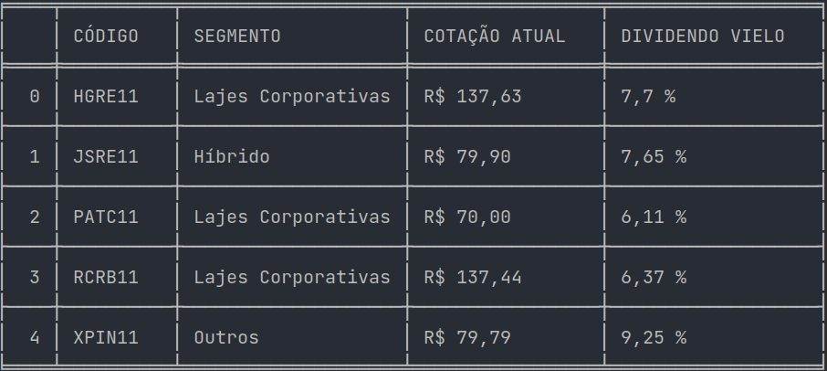

### Projeto báscio em python!

- conceitos básicos em loops e iteração.
- conceitos math do python.
- webscraping com python.

### Biblioteca utilizados 
- requests
- tabulate
- bs4

### Url da extração de dados 

- https://www.fundamentus.com.br/

### Projeto web-scraping
manipulação de dados,
limpeza de dados, montagem de estratégia, 
para aplicação de fundo imobiliarios...

# Notação

para roda á web-scraping em seu computado:

python 3.10.1 
pip install -r requirements.txt

com isso terá todas as dependencias necessárias para o projeto

# Result

